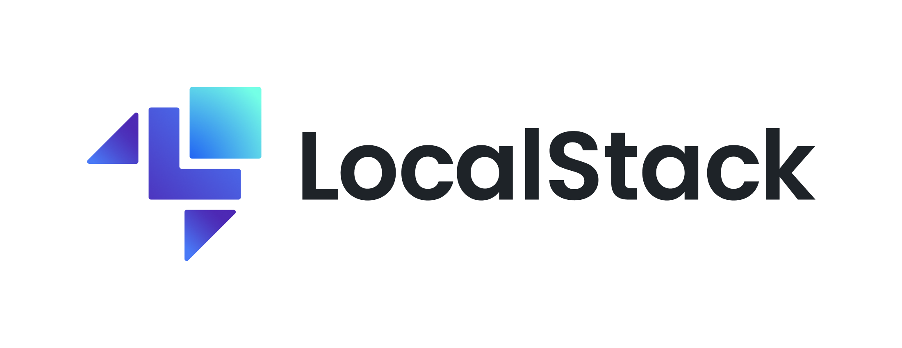

This is the documentation for the Python
`LocalStack's SDK <https://github.com/localstack/localstack-sdk-python>`_.

LocalStack offers a number of developer endpoints to programmatically interact
with LocalStack's features.

The complete OpenAPI spec can be found in the
`OpenAPI repository <https://github.com/localstack/openapi>`_.

Installation
------------

We recommend to user virtual environments to manage the dependencies of your project.

To create and activate a virtual environment inside your project run:

.. code-block:: shell

  python3 -m venv venv

You can activate the correspondent provider with:

.. code-block:: shell

    . venv/bin/activate

With the activated environment, use the following command to install the LocalStack Python SDK.

.. code-block:: shell

  pip install localstack-sdk-python

Getting Started
---------------

To learn about the basic SDK concepts and see how you can use it, please have a look at our
official `LocalStack documentation <https://docs.localstack.cloud/user-guide/tools/localstack-sdk/python/>`_.

API Reference
-------------

If you are looking for information on a specific function, class or
method, this part of the documentation is for you.

.. toctree::
   :maxdepth: 1

   modules